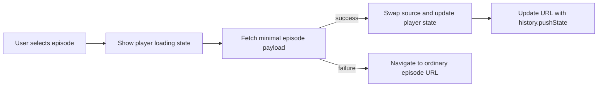

# Fix 04: make manual episode changes asynchronous

Priority: P0  
Risk: Medium  
Primary benefit: Episode-switch responsiveness and playback continuity

## Issue

Manual episode links in `templates/watch.gohtml` perform ordinary navigation to `/anime/:id/watch?ep=N`. In the audit, switching to episode 2 produced a new page shell after 0.91s and became playable after 2.59s.

The autoplay path already has most of the desired implementation in `static/player/episodes/nav.ts`: it fetches the minimal episode payload, updates player state, loads the new source, updates the episode UI, and calls `history.pushState`. That behavior is currently tied to `goToNextEpisode` and is not reused by manual episode, Previous, or Next controls.

## Goal

Use the existing minimal episode API for every in-player episode transition while preserving normal links as a reliable fallback.

## Proposed design

Extract a reusable function such as `transitionToEpisode(episode, options)` from `goToNextEpisode`.

The function should own:

- Validating the requested episode.
- Saving/resetting transition progress.
- Cancelling any previous episode transition.
- Showing the loading overlay.
- Fetching `/api/watch/episode/:animeId/:episode?mode=...`.
- Selecting the returned/fallback mode.
- Resetting the media element and loading the source.
- Updating subtitles, quality options, skip segments, title, active episode, and URL.
- Restoring focus when appropriate.
- Falling back to the link's `href` on failure.

`goToNextEpisode` then becomes a small policy wrapper that determines whether autoplay is enabled and calls `transitionToEpisode(nextEpisode)`.

## Event handling

Install one delegated click handler on the episode-list container rather than one listener per episode. Intercept only:

- Primary-button clicks.
- No modifier keys.
- Same-origin episode links for the current anime.
- Episodes not already active.

Do not intercept:

- Command/Ctrl-click, Shift-click, or middle-click.
- Links targeting a new browsing context.
- Invalid/missing episode IDs.
- Navigation when the player is not initialized.

Previous and Next controls should use the same transition function. Their real `href` values remain in the markup for no-JavaScript behavior and fallback.

## Concurrency and cancellation

Maintain one `AbortController` for episode payload fetches. When the user selects another episode before the previous one resolves:

1. Abort the old request.
2. Do not show an error toast for the intentional abort.
3. Ignore stale responses using a monotonically increasing transition ID.
4. Leave the current video playing until the replacement source is ready, or pause immediately only if product behavior explicitly prefers that.

The recommended behavior is to keep the current frame/video visible with a loading scrim, then swap once the new source is ready.

## History behavior

- Use `history.pushState` for user-initiated episode changes.
- Use `replaceState` only when normalizing the current URL.
- Add a `popstate` handler so Back/Forward transitions to the episode encoded in the URL without a full reload.
- If the `popstate` transition fails, reload the current URL to recover.

## Progress correctness

Before changing episodes:

- Save the old episode's current progress using the existing beacon/keepalive path.
- Do not mark the new episode at time zero until the transition is committed.
- Ensure aborted transitions do not overwrite progress for the currently playing episode.
- Prevent `beforeunload` from double-saving the wrong episode during the fallback navigation.

## Loading and error behavior

- Set an explicit transition state so duplicate clicks are ignored or superseded.
- Show the player loader immediately.
- If payload fetch fails, use the original link URL.
- If payload succeeds but media metadata fails, retry source refresh once, then navigate normally.
- Preserve the current mode when available; display the existing mode-fallback toast when it is not.

## Affected files

- `static/player/episodes/nav.ts`
- `static/player/main.ts`
- `static/player/state.ts`
- `static/player/episodes/ui.ts`
- `templates/watch.gohtml`
- Browser-flow tests under `static/player/`

## Tests

Add tests for:

- Clicking episode 2 fetches episode 2 and does not reload the document.
- Previous and Next use the same path.
- Modified clicks are not intercepted.
- A rapid episode 2 then episode 3 selection aborts episode 2 and commits episode 3 only.
- API failure navigates to the link URL.
- Mode fallback updates state and displays the notice.
- Back/Forward restores the correct episode.
- Progress belongs to the correct old/new episode.
- Active styling and episode-range switching update correctly.

## Observability

Measure:

- `episode_transition_payload_ms`
- `episode_transition_media_ready_ms`
- `episode_transition_total_ms`
- Async success versus full-navigation fallback count
- Aborted/stale transition count

Do not include signed stream tokens or upstream URLs in client logs.

## Rollout

Keep ordinary `href` navigation intact. The asynchronous path can be disabled quickly by removing the delegated interceptor. Roll out before adding prefetch so behavioral failures are easier to isolate.

## Acceptance criteria

- Manual episode, Previous, and Next actions do not reload the page on success.
- Warm episode transitions reach playable metadata in under 1.5 seconds at p75 under representative conditions.
- Back/Forward works.
- Modified clicks retain native browser behavior.
- Every failure can recover through ordinary navigation.
- Progress, mode, subtitles, and active episode remain correct.
